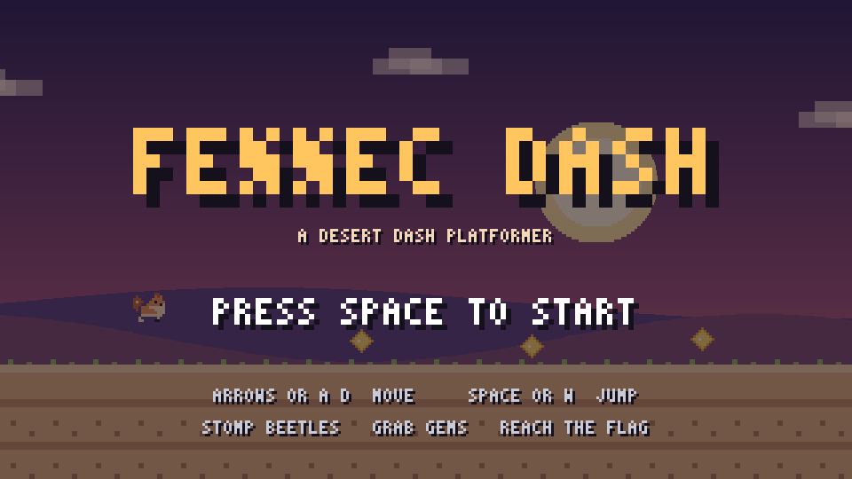

# Fennec Dash

A 2D side-scrolling pixel-art platformer written in **Zig** with **SDL3**. Play as a
little desert fox dashing across sun-baked dunes: run, jump, stomp beetles, grab
sun-gems, and reach the flag at the end.

Unlike the other entries (Rust + macroquad), this one is Zig + SDL3. All the art is
drawn procedurally at a 320×180 virtual resolution and scaled up crisply, so there
are no image assets to ship.



## Controls

| Action | Keys |
| --- | --- |
| Move | `←` / `→` or `A` / `D` |
| Jump | `Space` / `W` / `↑` (hold for a higher jump) |
| Start / Restart | `Space` (title), `R` (after win or game over) |
| Quit | `Esc` |

## Gameplay

- **Stomp** beetles from above to pop them and bounce; touch one from the side and
  you take a hit.
- **Spikes** and **falling into a pit** cost a heart. You have three.
- **Sun-gems** are scattered along the route — collect as many as you can.
- Reach the **flag** to win. Your gems and time are shown on the results screen.
- Falling into a pit respawns you at the last safe ground you stood on.

Feel is tuned with the usual platformer niceties: acceleration/friction, coyote
time, jump buffering, variable jump height, and a smooth follow camera.

## Requirements

- [Zig](https://ziglang.org) 0.16
- SDL3 — on macOS: `brew install sdl3`

The build points at Homebrew's SDL3 at `/opt/homebrew/opt/sdl3`. If yours lives
elsewhere, adjust the include/library paths in `build.zig`.

## Build & run

```sh
zig build run                       # debug
zig build run -Doptimize=ReleaseFast  # release (recommended)
```

Or from the repo root via the helper script:

```sh
./run.sh fennec
```

## Layout

| File | What's in it |
| --- | --- |
| `src/main.zig` | Window, SDL setup, fixed-timestep loop, input |
| `src/game.zig` | Game state, physics, enemies, gems, particles, camera, rendering |
| `src/level.zig` | The hand-built level (ground, pits, platforms, spawns) |
| `src/sprites.zig` | Pixel-art sprites (fox, beetle, gem, heart) and palette |
| `src/draw.zig` | Drawing helpers: world/screen rects, sprite blit, pixel font |
| `src/font.zig` | Compact 3×5 bitmap font |
| `src/sdl.zig` | SDL3 C import and the `Color` type |
